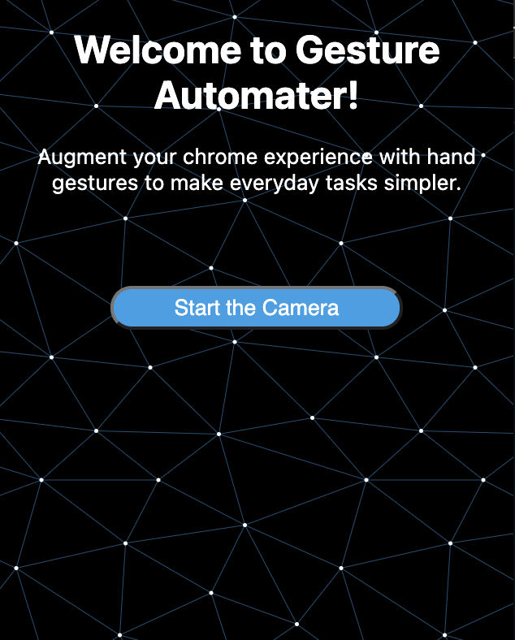
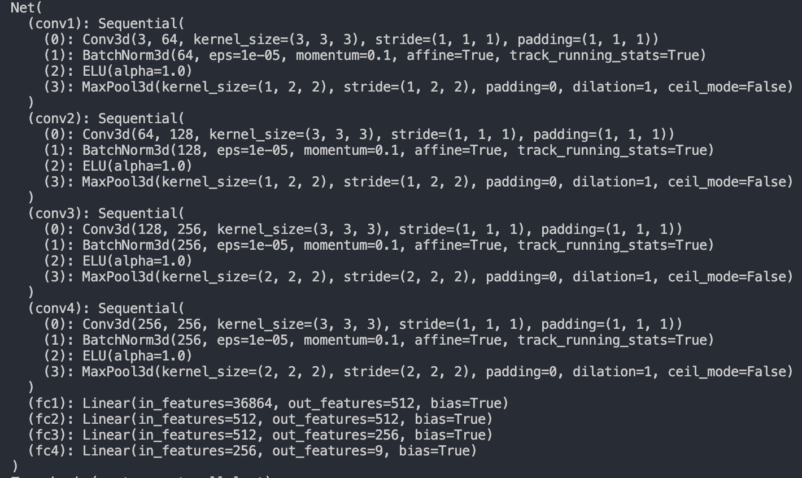

# Gesture-Auto

## What is Gesture-Auto?
Gesture-Auto is a chrome extension that allows users to interface with a website using hand gestures detected through their webcam. It can detect gestures such as swipes, taps, and clicks that are performed on the webpage. 

## How does it work?
Gesture-Auto uses a 3D convolutional neural networks trained on the 20BN-JESTER dataset and achieved a validation accuracy of around 91% on the test set after training for 20 epochs on GPU. The model architecture is as follows:

The server was made using flask to serve the model using aiortc. It is currently not hosted anywhere.

